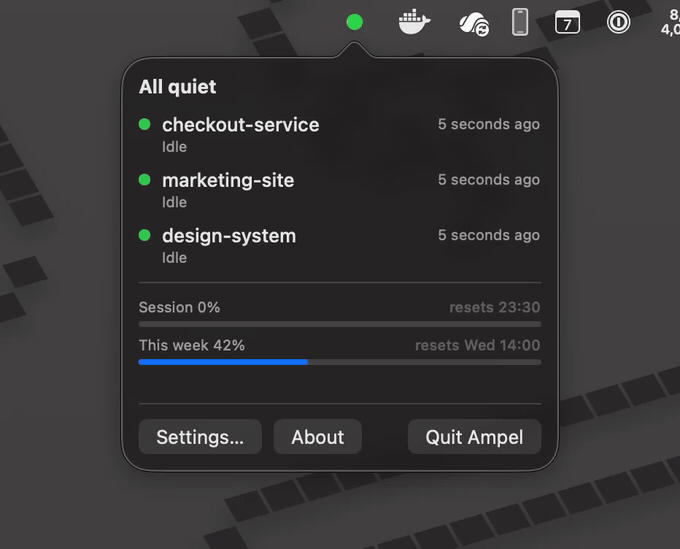
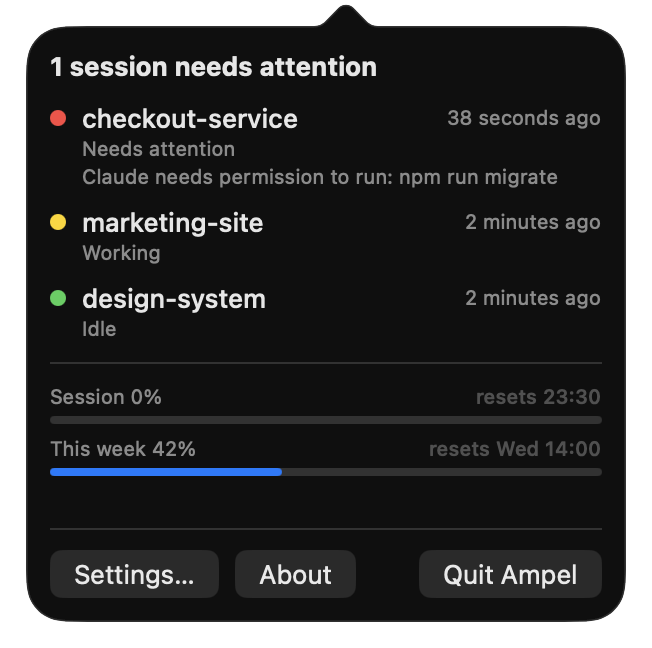
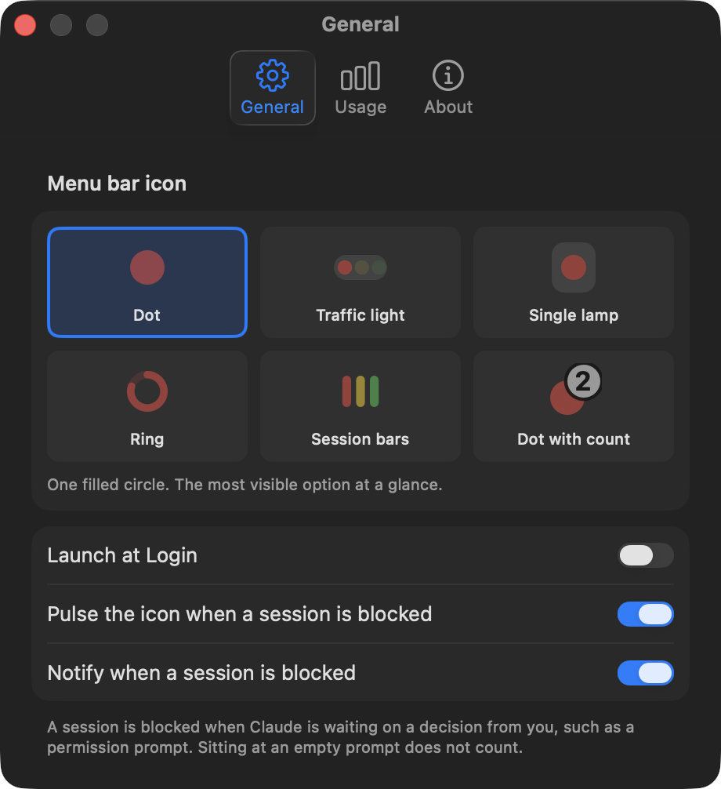
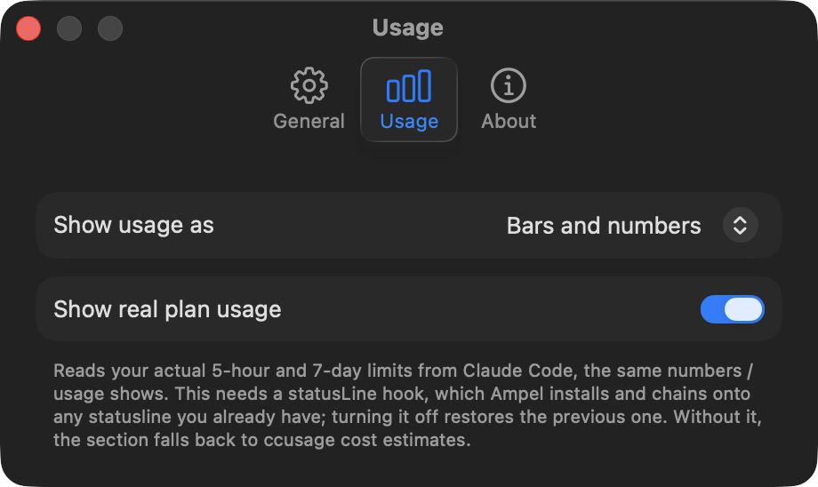
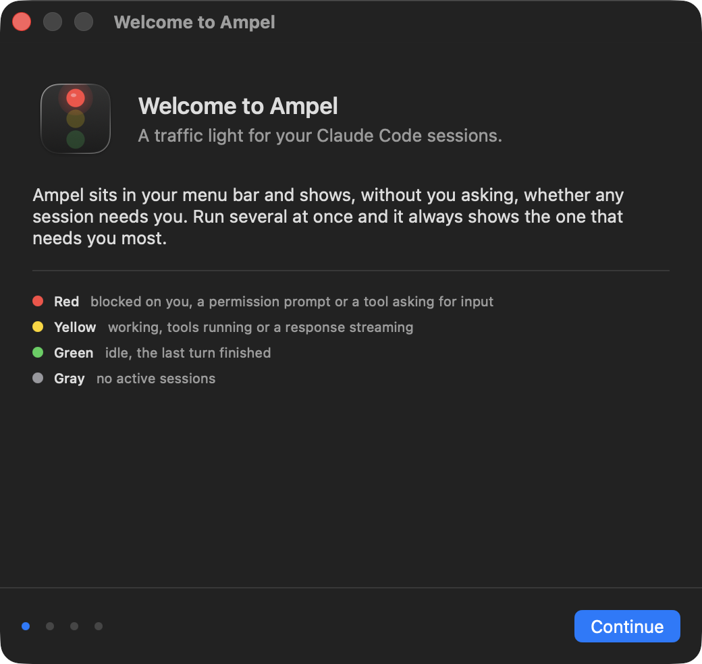

# Ampel

A native macOS menu bar app that shows, at a glance, whether any running Claude Code session needs your attention — like a traffic light.

<p align="center">
  
</p>

| Color | State | Meaning |
|---|---|---|
| 🔴 Red | `attention` | Claude is blocked on a decision from you: a permission prompt or a tool asking for input |
| 🟡 Yellow | `working` | Claude is actively processing (tools running, response streaming) |
| 🟢 Green | `idle` | Last turn finished, nothing pending |
| ⚪️ Gray | `off` | No active Claude Code sessions |

Multiple sessions aggregate worst-case: red beats yellow beats green. Clicking the icon, with either button, opens a menu listing each session (project, state, last activity) plus a usage section. Sessions sharing a project name get a short session id so parallel sessions in one repo stay tellable apart.

Red means Claude is blocked on a decision from you. Claude Code also fires a notification whenever a session sits at an empty prompt, which Ampel deliberately ignores: treating that as attention pinned the icon red for as long as any session was merely open.

## How it works

Claude Code hooks (configured in `~/.claude/settings.json`) fire a tiny shell script on lifecycle events. The script drops one JSON file per event into `~/.ampel/events/`. Ampel.app watches that directory, updates per-session state, and renders the aggregate as a colored menu bar icon. No local server, no dependencies in the hook path.

## Usage numbers

Two sources, showing different things.

**Real plan limits**, the same percentages `/usage` shows, are opt-in under Settings > Usage. Claude Code passes them on the statusLine hook's stdin, so Ampel installs a statusLine wrapper that chains onto whatever statusline you already have and restores it when you turn the setting off. Per-model figures are not in the payload and cannot be shown.

**Estimated cost** comes from [ccusage](https://github.com/ryoppippi/ccusage), which parses the JSONL transcripts under `~/.claude/projects/`. Optional, and the app degrades to a single line without it. On a subscription plan these dollars are notional, what the same tokens would have cost on the API, so they will never match the plan percentages.

## Settings

A normal preferences window with General, Usage and About panes: launch at login, whether the icon pulses and whether blocked sessions raise a notification, how the usage section is drawn (bars, numbers only, or hidden), and the real-plan-usage opt-in.

## Documents

- `CLAUDE.md` — working agreement for Claude Code building this project
- `docs/SPEC.md` — full technical specification (architecture, hook contract, state machine, UI)
- `docs/MILESTONES.md` — build plan with acceptance criteria, execute in order

## Install

```sh
brew trust appgineering/tap
brew tap appgineering/tap
brew install --cask ampel
```

`brew trust` comes first because Homebrew 6 refuses to load casks from a tap you have not explicitly trusted, and reports the refusal as a syntax error. Or download the latest [release](https://github.com/appgineering/Ampel/releases), unzip, and drag `Ampel.app` to `/Applications`.

The icon starts gray. Open it and use the setup guide to install the Claude Code hooks; nothing is tracked until those are in place.

## Generating the Xcode project

The project is defined in `project.yml` (XcodeGen). The `.xcodeproj` is generated and gitignored:

```
brew install xcodegen
xcodegen generate
open Ampel.xcodeproj
```

Run `./Tests/run.sh` for the self-checks: the session state machine, ccusage and plan-usage parsing, and the hook installer's merge against throwaway home directories. `./Tools/make-icon.sh` regenerates the app icon from vector source.

## Requirements

macOS 14+, Xcode 16+, XcodeGen, Claude Code CLI. Not sandboxed, not for the App Store, a personal utility.

Set `~/.ampel/debug` to make the hook append every envelope it writes to `~/.ampel/hook.log`. Ampel deletes each spool file once applied, so this is the only way to reconstruct what a session actually emitted.

## Screenshots

| | |
|---|---|
|  |  |
| Every session, worst first, with the reason it is waiting. | Six icon styles, previewed live. |
|  |  |
| Real plan limits, or ccusage estimates, or nothing. | A setup guide on first launch. |

## Privacy

Ampel collects nothing and makes no network requests of its own. See [PRIVACY.md](PRIVACY.md) for exactly which files it reads and writes, including the one opt-in debug mode that records prompt text locally.

## License

MIT, see [LICENSE](LICENSE).

Built by [Appgineering](https://appgineering.com/?utm_source=ampel&utm_medium=readme&utm_campaign=github).

Ampel is not affiliated with, endorsed by, or sponsored by Anthropic. Claude and Claude Code are trademarks of Anthropic, PBC.

[ccusage](https://github.com/ryoppippi/ccusage) is an optional, separately licensed tool (MIT, by ryoppippi). Ampel runs it as a subprocess when it is installed and does not bundle or link any part of it.
